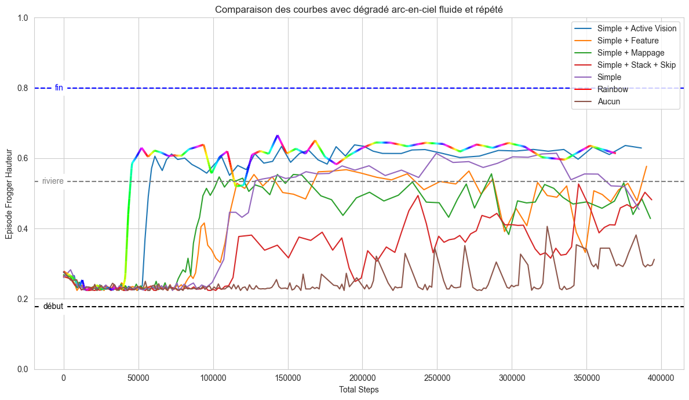

# Projet de Renforcement Learning sur Frogger Atari (DQN & TRPO)

## Table des matières
1. [Context](#context)
2. [Installation](#installation)
3. [Utilisation](#utilisation)
4. [Exemples](#exemples)
4. [Amélioration](#Amélioration)
5. [Configuration JSON](#configuration-json)
6. [Structure du projet](#structure-du-projet)

## Context

#### Introduction
Ce projet explore l'application du renforcement learning pour jouer au jeu Atari Frogger en utilisant les algorithmes DQN (Deep Q-Network) et TRPO (Trust Region Policy Optimization). L'objectif est de comparer les performances de ces algorithmes et d'analyser l'impact des différents hyperparamètres et techniques de prétraitement.

#### Enviromment
ALE (Arcade Learning Environment) est une plateforme permettant d'interagir avec des jeux Atari 2600, tandis que Gymnasium est une bibliothèque Python offrant une interface standardisée pour les environnements de renforcement learning. Ces outils permettent de simuler des jeux Atari et de collecter des données pour l'entraînement et l'évaluation des agents.

#### Présentation de Frogger
[Frogger](https://www.retrogames.cz/play_031-Atari2600.php) est un jeu classique où le joueur guide une grenouille à travers une route et une rivière pour atteindre des nénuphars. L'objectif est de maximiser le score en évitant les obstacles et en atteignant les nénuphars rapidement. Connu pour sa difficulté et son gameplay rapide, Frogger représente un défi intéressant pour les agents de renforcement learning.
[Frogger Atari environments](https://ale.farama.org/environments/frogger/)


## Installation
Le projet est conçu pour fonctionner de manière autonome grâce à un environnement virtuel Python. On vous a fourni les librairies pré téléchargées. 
Il va falloir créer l'environnement (étape 1)) ce qui peut prendre quelque minutes. Une fois que l'environnement sera installé, vous n'aurez plus à refaire cette étape et vous pourrez commencer directement par l'étape 2).


1) Créer l'environnement virtuel du projet:
```bash
git clone https://github.com/EvanTrvs/Projet-RL-Frogger.git
python -m venv environnement_projet
environnement_projet\Scripts\activate
pip install --no-index -r requirements.txt
```

## Utilisation

### 1. Entraînement

Pour lancer l'entraînement, utilisez la commande suivante :
```bash
python run.py votre_fichier_config.json
```
Le fichier de `configuration JSON` est essentiel car il permet de spécifier l'algorithme à utiliser ainsi que de paramétrer entièrement l'entraînement (hyperparamètres, environnement, prétraitement, nombre de steps, sorties, etc.).

Si besoin, il existe des fichiers de configuration JSON prêt à etre utilisé pour faire un entrainement avec DQN ou TRPO:
```bash
python run.py common\utils\exemple_config_json\config_DQN_CNN.json
```
```bash
python run.py common\utils\exemple_config_json\config_TRPO.json
```

### 2. Sortie
Par défaut dans le répertoire `experiments/`, un fichier CSV est incrémenté avec des données au fil de l'entraînement. Ce fichier contient des traces informatives sur les épisodes, permettant de suivre l'apprentissage, d'évaluer les performances et de produire des résultats graphiques. Des exemples se trouve dans le répertoire `experiments/`.

### 3. Visualisation
Il est possible d'utiliser les fichiers CSV générés pour produire des graphiques d'évolution de différentes métriques au cours de l'apprentissage. Un exemple de ces graphiques se trouve dans le répertoire `results/`. Le script Python `results/learning_csv_curve.py` permet de visualiser facilement l'entraînement à partir d'un fichier CSV.

Pour générer un graphique, utilisez la commande suivante :
```bash
python learning_csv_curve.py chemin/vers/votre_fichier.csv
```
```bash
python learning_csv_curve.py experiments\TRPO_exemple\TRPO_results_exemple.csv
```

## Exemples

Voici un exemple de courbe de l'évolution de la performance de hauteur atteinte au cours de l'entrainement :     
    

Impact du preprocessing sur la capacité a généraliser rapidement la partie Route:


Voici un exemple vidéos montrant un agent entraîné en action :     
      
     

Il est également possible de se mettre à la place d'un agent pour jouer à l'environnement. Cela permet de tester l'environnement, de visualiser différentes situations et de voir le prétraitement appliqué. Pour jouer à l'environnement, utilisez la commande suivante :
```bash
python jouer_frogger.py
```

## Amélioration

Notre implémentation s'inspire de divers travaux et sources, auxquels nous avons apporté des améliorations pour mieux résoudre l'environnement Atari Frogger :    
- **Prétraitement avancé** : Réduction d'image, vision active et mappage.
- **DQN amélioré** : Avec ou sans Prioritized Experience Replay.
- **Architectures flexibles** : DQN avec FCNN ou CNN, compatible avec tous les prétraitements.
- **Agent dual contextuel** : Deux structures DQN spécialisées pour les phases route et rivière.
- **Features numériques** : Calcul et intégration de features numériques en plus des images.
- **Reward shaping personnalisé** : Adapté spécifiquement au jeu Frogger.
- **Métrique de hauteur** : Adaptée à l'environnement pour un suivi précis.
- **Suivi détaillé** : Pour DQN et TRPO, permettant une analyse approfondie de l'entraînement.
- **Environnement optimisé** : Adapté pour un jeu Frogger non déterministe.

## Configuration JSON

Le projet utilise un système de configuration basé sur JSON, permettant de réaliser des expériences de manière transparente sans modifier le code. Certains paramètres ont des interdépendances et des incompatibilités. Nous déconseillons de faire de grandes variations sans comprendre les configurations (explosion de taille mémoire, très grande durée, ...). Chaque section correspond à un bloc du JSON et décrit les paramètres, leurs valeurs possibles, et leur impact.

### Configuration Générale

- **name**: Nom de l'expérience.
- **algorithm**: Algorithme utilisé (`"dqn"` ou `"trpo"`).
- **output_dir**: Répertoire où les résultats seront sauvegardés.
- **device**: Dispositif d'exécution (`"cpu"` ou `"cuda" pour le GPU avec NVIDIA`).

### Configuration de l'Environnement

- **name**: Nom de l'environnement Atari `"ALE/Frogger-v5"`.
- **render_mode**: Mode de rendu (`"rgb_array"` ou `"human"` pour avec un retour visuel sur l'environnement).
- **max_episode_steps**: Nombre maximum de pas par épisode (optionnel, pour DQN).
- **reward_shaping**: Type de mise en forme des récompenses (`"classic"` pour celui de Frogger, `"custom"` pour le Reward Shaping).
- **EpisodicLifeEnv**: Si `true`, met fin à un épisode lorsque l'agent perd une vie, rend le jeux non déterministe.

### Configuration du Prétraitement

- **rognage_bords**: Rogner les bords de l'image (`true` ou `false`).
- **grayscale**: Convertir les images en niveaux de gris (`true` ou `false`).
- **flou**: Taille des noyaux pour appliquer un flou gaussien (ex: `[0, 0]`).
- **downscaling**: Taille de redimensionnement des images (ex: `[72, 84]`).
- **centrer_grenouille**: Paramètres pour centrer la grenouille (ex: `[0, 0, [0, 0, 0]]`).
- **mappage_pixels**: Appliquer un mappage de pixels custom (`true` ou `false`).
- **frame_stacking**: Nombre de frames empilées (entre `0` et `10`).
- **frame_skip**: Type de frame skip (`"first-mid-last"`, `"none"`, `"first-last"`).
- **extract_features**: Extraire des features spécifiques (`true` ou `false`).

### Configuration DQN

#### Hyperparamètres

- **epsilon_decay**: Taux de décroissance d'epsilon (ex: `0.9995`).
- **minimum_epsilon**: Valeur minimale d'epsilon (ex: `0.05`).
- **learning_rate**: Taux d'apprentissage (ex: `0.00025`).
- **target_update**: Fréquence de mise à jour du réseau cible (ex: `1000`).
- **gamma**: Facteur de discount (ex: `0.99`).
- **soft_update**: Utiliser une mise à jour douce du réseau cible (`true` ou `false`).
- **tau**: Taux de mise à jour douce (ex: `0.01`).
- **optimizer**: Optimiseur utilisé (`"adam"`).
- **loss_fn**: Fonction de perte (`"mse"` ou `"huber"`).
- **grad_clip**: Valeur de clipping des gradients (ex: `2.0`).
- **steps_frequency_update**: Fréquence de mise à jour des steps (ex: `2`).

#### Configuration du Réseau

- **network_type**: Type de réseau (`"cnn"` ou `"fc"`).
- **num_features**: Nombre de features numériques supplémentaires (ex: `0`).
- **dropout**: Taux de dropout global (ex: `0.3`).

#### Configuration de la Mémoire

- **type**: Type de replay buffer (`"prioritized"` ou `"classic"`).
- **buffer_size**: Taille du replay buffer (ex: `100000`).
- **batch_size**: Taille des mini-batch (ex: `32`).
- **alpha**: Paramètre de priorisation (ex: `0.6`).
- **beta**: Paramètre de correction de biais (ex: `0.4`).
- **prior_eps**: Petite constante pour éviter les priorités nulles (ex: `1e-6`).

### Configuration TRPO

- **max_kl**: Limite supérieure pour la divergence KL (ex: `1e-2`).
- **damping**: Paramètre d'amortissement (ex: `1e-2`).
- **l2_reg**: Régularisation L2 (ex: `1e-3`).
- **use_fim**: Utiliser la matrice d'information de Fisher (`true` ou `false`).
- **gamma**: Facteur de discount (ex: `0.98`).
- **tau**: Paramètre de mise à jour (ex: `0.95`).
- **batch_size**: Taille des mini-batchs (ex: `64`).

### Configuration de l'Entraînement

- **max_training_steps**: Nombre maximum de steps d'entraînement (ex: `200000`).
- **eval_interval_steps**: Intervalle de steps pour l'évaluation (ex: `50000`).
- **log_every_n_episodes**: Fréquence de logging des épisodes (ex: `5` pour DQN).

### Configuration de l'Évaluation

- **num_parties**: Nombre d'épisodes d'évaluation (ex: `5`).
- **env_gif**: Enregistrer des GIFs des épisodes d'évaluation du jeu brut (`true` ou `false`).
- **observation_gif**: Enregistrer des GIFs des épisodes d'évaluation du jeu prétraité (`true` ou `false`).
- **trace_actions**: Écrire un CSV de trace détaillé des steps des épisodes d'évaluation (`true` ou `false`).

### Exemple JSON

Voici un exemple complet de configuration :

```json
{
    "name": "DQN_Classique_CNN",
    "algorithm": "dqn",
    "output_dir": "experiments",
    "device": "cuda",
    "env": {
        "name": "ALE/Frogger-v5",
        "render_mode": "rgb_array",
        "max_episode_steps": 250,
        "reward_shaping": "classic",
        "EpisodicLifeEnv": true
    },
    "preprocessing": {
        "rognage_bords": true,
        "grayscale": true,
        "flou": [ 0, 0 ],
        "downscaling": [ 48, 56 ],
        "centrer_grenouille": [ 0, 0, [0, 0, 0] ],
        "mappage_pixels": false,
        "frame_stacking": 1,
        "frame_skip": "none",
        "extract_features": false 
    },
    "dqn": {
        "hyperparameters": {
            "epsilon_decay": 0.9997,
            "minimum_epsilon": 0.05,
            "learning_rate": 0.00015,
            "target_update": 1000,
            "gamma": 0.98,
            "soft_update": true,
            "tau": 0.025,
            "optimizer": "adam",
            "loss_fn": "mse",
            "grad_clip": 5.0,
            "steps_frequency_update": 2
        },
        "network": {
            "network_type": "cnn",
            "dropout": 0.2,
            "num_features": 0
        },
        "memory": {
            "type": "prioritized",
            "buffer_size": 150000,
            "batch_size": 32,
            "alpha": 0.6,
            "beta": 0.4,
            "prior_eps": 0.00001
        }
    },
    "trpo": {
        "hyperparameters": {
            "max_kl": 1e-2,
            "damping": 1e-2,
            "l2_reg": 1e-3,
            "use_fim": true,
            "gamma": 0.98,
            "tau": 0.95,
            "batch_size": 64
        }
    },
    "training": {
        "max_training_steps": 15000000,
        "eval_interval_steps": 100000,
        "log_every_n_episodes": 20,
    },
    "evaluate": {
        "num_parties": 20,
        "env_gif": false,
        "observation_gif": false,
        "trace_actions": true
    }
}
```

## Structure du projet

```
project/
├── common/                     # Composants communs utilisé par tout les algo
│   ├── environnement/          # Gestion de l'environnement
│   │   ├── atarienv.py         # Classe principale d'environnement
│   │   └── wrappers.py         # Wrappers pour l'environnement
│   ├── preprocessing/          # Prétraitement des observations
│   │   ├── preprocessor.py     # Classe principale de prétraitement
│   │   └── transforms.py       # Transformations d'images
│   └── utils/                  # Utilitaires
│       ├── config.py           # Objets contenant la configuration
│       └── gif_maker.py        # Création de GIFs
│ 
├── algorithms/                 # Implémentations des algorithmes
│   ├── trpo/                   # Utilitaires pour TRPO
│   │   ├── trpo.py             
│   │   └── wrapper_trpo/       
│   └── dqn/                    # Implémentation DQN
│       ├── run.py              # Lanceur entrainement DQN
│       ├── dqn_agent.py        # Corps de l'Agent DQN
│       ├── trainer.py          # Boucle principale d'entraînement épisodes/steps
│       ├── memory/             # Répertoire relatif au Replay Buffer PER/Random
│       └── networks/           # Répertoire relatif au Réseaux neuronnal FCNN/CNN
│ 
├── experiments/                # Répertoire pour les sorties
│
├── jouer_frogger.py            # Petit script pour jouer à la place d'un agent
│
└── run.py                      # Lanceur principal du projet, pour DQN ou TRPO
```

## Dépendances principales
- Python 3.8+
- PyTorch
- Gymnasium
- NumPy
- OpenCV
- Pandas
- ImageIO

## Contributeurs
- @EvanTrvs
- @HenriSalard
- @Luraniart
- @natan842.beaujean
- @SIGRlD


## Références
- [DeepMind's DQN Paper](https://www.nature.com/articles/nature14236)
- [TRPO Paper](https://arxiv.org/abs/1502.05477)
- [Gymnasium Documentation](https://gymnasium.farama.org/)
- [ALE Documentation](https://github.com/mgbellemare/Arcade-Learning-Environment)
- [DQN Prioritized Replay](https://github.com/Howuhh/prioritized_experience_replay)
- [Prioritized Experience Replay](https://arxiv.org/abs/1511.05952)
- [Playing Atari with Deep Reinforcement Learning](https://arxiv.org/abs/1312.5602)
